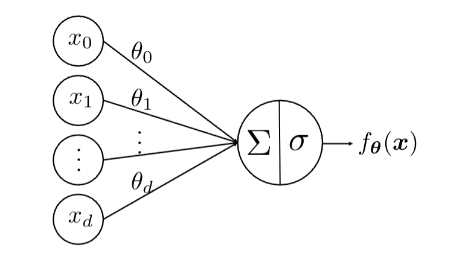
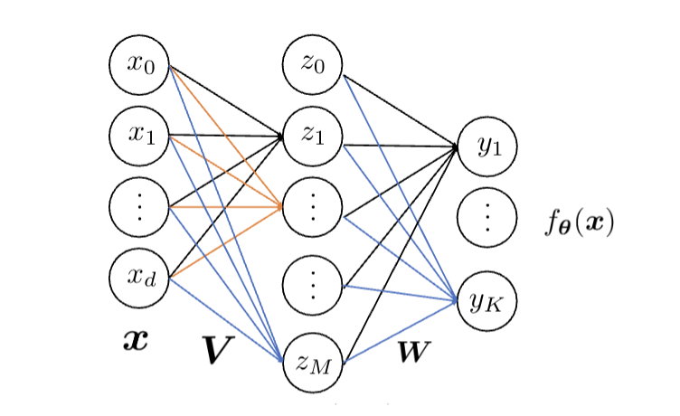

# 神经网络 - Neural Network

本系列笔记记录了我对LLM领域基础知识的学习过程。本篇介绍神经网络以及反向传播。

## Neural Networks - 神经网络
监督学习的本质是用$f_{\theta}$去逼近理想化的目标函数$g$。神经网络是最具代表性的非线性模型，因其具有通用逼近能力。

### 单层神经网络

  
  
图 1: 单层神经网络

图1是单层神经网络的结构。可以表示为：
$$f_{\theta}(x) = \sigma\left(\sum_{i=0}^{d} \theta_i x_i\right) = \sigma(\theta^{\top}x)$$

其中，$\theta$就是神经网络的“参数”（或“权重”），代表“此神经元是由上层神经元的怎样的线性组合得来”。$\sigma$表示激活函数，用于对线性组合的结果做非线性或线性的变换。

### 单隐藏层（双层）神经网络

  
  
图 2: 单隐藏层神经网络

单隐藏层神经网络可以表示为：
$$y = f_{\theta}(x) = h(W\sigma(Vx))$$

其权重为$V \in \mathbb {R}^{d \times M}$,$W \in \mathbb {R}^{K \times M}$。

### 激活函数

常见的$\sigma$（中间层的激活函数）有：
- 历史上常用的 $\sigma$ 选择是 Logistic / Sigmoid 函数 ：$$\sigma(t) = \frac{1}{1 + e^{-t}}$$
- 与 Sigmoid 激活函数类似的选择是 tanh 激活函数：$$\sigma(t) = \frac{e^t - e^{-t}}{e^t + e^{-t}}$$
- 另一个非常流行的 $\sigma$ 选择是 ReLU (修正线性单元) 激活函数 60：$$\sigma(t) = \max(0, t)$$

$h$（即最后一层的激活函数）代表神经网络最终输出的结果，其选择标准如下：
- 回归 (Regression)：通常使用 $h(t) = t$。
- 二分类逻辑回归：其中 $K=1, y \in \{+1, -1\}$。预测两个类别的概率：$h(t) = \frac{1}{1 + e^{-y \cdot t}}$。
- 多分类 (Multiclass classification)：$$h(t_k) = \frac{e^{t_k}}{\sum_{j=1}^{K} e^{t_j}}, \quad t_k = w_k^{\top} z$$这是让最后一层成为一个多分类逻辑回归分类器。

回归与分类的区别：回归任务的目标结果是连续的，而分类任务的目标结果是离散的。

### 通用逼近能力

定理：通用逼近能力-令 $g$ 为 $d$ 维空间中有界子集上的连续函数。那么，存在一个具有有限数量隐藏神经元的单隐藏层神经网络 $f_{\theta}$，可以任意好地逼近 $g$。即对于所有样本 $x$，对于每一个 $\epsilon > 0$，都有 $|f_{\theta}(x) - g(x)|< \epsilon$。

### 训练目标：

设训练数据为$(x_1, y_1), \dots, (x_n, y_n)$，其中 $x_i \in \mathbb{R}^d$，$y_i \in \mathbb{R}^K$，神经网络模型为$f_{\theta}(x) = h(W\sigma(Vx))$，则：

- 对于回归问题：$$\min_{\theta} \left( L(\theta) = \frac{1}{n} \sum_{i=1}^{n} \|y_i - f_{\theta}(x_i)\|_2^2 \right)$$
- 对于多分类问题：$$\min_{\theta} \left( L(\theta) = -\frac{1}{n} \sum_{i=1}^{n} y_i^{\top} \log(f_{\theta}(x_i)) \right)$$ 其中h为softmax函数。

神经网络的训练是非凸优化的。例如，回归训练问题可以写为：$$\min_{\theta=(V, W)} \left( L(\theta) = \frac{1}{n} \sum_{i=1}^{n} \|y_i - h(W\sigma(Vx_i))\|^2 \right)$$这是一个高度非凸的优化问题。

神经网络的训练可以抽象为以下问题：
$$\min_{\theta} \left( L(\theta) = \frac{1}{n} \sum_{i=1}^{n} \ell_i(\theta) \right)$$
计算梯度：$$\nabla L(\theta) = \frac{1}{n} \sum_{i=1}^{n} \nabla \ell_i(\theta)$$
用梯度下降方法进行更新：
$$\theta_{k+1} = \theta_k - \mu_k \nabla L(\theta_k)$$

## Backpropagation - 反向传播
以平方误差损失为例，进行反向传播中的梯度推导（对于图2中的单隐藏层神经网络）。反向传播分为两个部分：
- 前向过程 (Forward pass)：给定一个 $x$，计算（使用当前参数 $V$ 和 $W$）：$$z = \sigma(Vx), \quad f_\theta(x) = h(Wz), \quad l(\theta) = \|y - f_\theta(x)\|_2^2$$
- 反向过程 (Backward pass)：第二层：计算 $\frac{\partial l}{\partial W}$，并计算 $\frac{\partial l}{\partial z}$。第一层：计算 $\frac{\partial l}{\partial V} = \frac{\partial l}{\partial z} \times \frac{\partial z}{\partial V}$。

由此看来，反向过程中所需计算量大约是前向过程的2倍。前向传播中主要存储了每层的激活值（即这里的$z$），而反向过程中相对地要求出损失函数对权重的导数（$\frac{\partial l}{\partial W}$）以及对此激活值的导数（$\frac{\partial l}{\partial z}$）。

反向过程的具体计算过程如下：

$$\frac{\partial l}{\partial W} = \begin{bmatrix} \frac{\partial l}{\partial W(1,1)} & \dots & \frac{\partial l}{\partial W(1,M)} \\ \vdots & \ddots & \vdots \\ \frac{\partial l}{\partial W(K,1)} & \dots & \frac{\partial l}{\partial W(K,M)} \end{bmatrix} \in \mathbb{R}^{K \times M}$$
为了简单起见，我们关注 $\frac{\partial l}{\partial W}$ 中的一个元素 $\frac{\partial l}{\partial W(k,m)}$。注意在前向过程中，我们已经计算了：$$l(\theta) = \|y - h(Wz)\|_2^2$$其中 $z = \sigma(Vx) \in \mathbb{R}^M$。

$$\frac{\partial l}{\partial W(k, m)} = \frac{\partial}{\partial W(k, m)} \|h(Wz) - y\|_2^2$$ $$= \frac{\partial}{\partial W(k, m)} \sum_{j=1}^{K} (h(w_j^\top z) - y[j])^2$$ $$= \frac{\partial}{\partial W(k, m)} (h(w_k^\top z) - y[k])^2$$ $$= \frac{\partial (h(w_k^\top z) - y[k])^2}{\partial (h(w_k^\top z) - y[k])} \times \frac{\partial (h(w_k^\top z) - y[k])}{\partial w_k^\top z} \times \frac{\partial w_k^\top z}{\partial W(k, m)}$$ $$= 2(h(w_k^\top z) - y[k]) \times h'(w_k^\top z) \times z[m]$$ $$:= \delta[k] \times z[m]$$其中 $w_k^\top \in \mathbb{R}^M$ 是 $W$ 的第 $k$ 行，且我们定义了：$$\delta[k] = 2(h(w_k^\top z) - y[k])h'(w_k^\top z)$$

令：$$\delta = \begin{bmatrix} \delta[1] \\ \delta[2] \\ \vdots \\ \delta[K] \end{bmatrix} = 2(h(Wz) - y) \odot h'(Wz) \in \mathbb{R}^K$$其中 $\odot$ 是逐元素积。我们有：$$\frac{\partial l}{\partial W} = \underbrace{\delta}_{K \times 1} \underbrace{z^\top}_{1 \times M} \in \mathbb{R}^{K \times M}$$

接下来计算第一层的参数梯度。首先计算：$\frac{\partial l}{\partial z}$，同样先取$z$的一个分量$z[m]$进行计算：

$$\frac{\partial l}{\partial z[m]} = \frac{\partial}{\partial z[m]} \|h(Wz) - y\|_2^2$$ $$= \frac{\partial}{\partial z[m]} \sum_{k=1}^{K} (h(w_k^\top z) - y[k])^2$$ $$= \sum_{k=1}^{K} 2(h(w_k^\top z) - y[k]) \times h'(w_k^\top z) \times w_k[m]$$ $$= \sum_{k=1}^{K} \delta[k] w_k[m]$$结合 $z$ 的所有单个节点，我们令：$$\frac{\partial l}{\partial z} = W^\top \delta \in \mathbb R^{M}$$

有了$\frac{\partial l}{\partial z[m]}$，我们就可根据链式法则计算$\frac{\partial l}{\partial V}$：

$$\frac{\partial l}{\partial V} = \begin{bmatrix} \frac{\partial l}{\partial V(1,1)} & \dots & \frac{\partial l}{\partial V(1,d)} \\ \vdots & \ddots & \vdots \\ \frac{\partial l}{\partial V(M,1)} & \dots & \frac{\partial l}{\partial V(M,d)} \end{bmatrix} \in \mathbb{R}^{M \times d}$$对于 $V$ 的单个元素：$$\frac{\partial l}{\partial V(m, j)} = \frac{\partial l}{\partial z[m]} \times \frac{\partial z[m]}{\partial V(m, j)}$$ $$= \frac{\partial l}{\partial z[m]} \times \frac{\partial \sigma(v_m^\top x)}{\partial V(m, j)} \quad (\text{由于 } z = \sigma(Vx))$$ $$= \sum_{k=1}^{K} \delta[k] w_k[m] \times \sigma'(v_m^\top x) \times x[j]$$结合各单个元素的梯度：$$\frac{\partial l}{\partial V} = \underbrace{(W^\top \delta) \odot \sigma'(Vx)}_{M \times 1} \times \underbrace{x^\top}_{1 \times d} \in \mathbb{R}^{M \times d}$$

--- 
对于更一般的情况，作如下推导：
1. 基础推导模型假设前向传播是一个线性映射：$$\mathbf{Y} = \mathbf{X} \mathbf{W}$$其中：$\mathbf{X} \in \mathbb{R}^{M \times K}$ (输入)$\mathbf{W} \in \mathbb{R}^{K \times N}$ (权重)$\mathbf{Y} \in \mathbb{R}^{M \times N}$ (输出)我们假设最终的损失函数为 $L$。在反向传播时，我们已经拿到了上层传回的梯度：$$\mathbf{G}_Y = \frac{\partial L}{\partial \mathbf{Y}} \in \mathbb{R}^{M \times N}$$
2. 推导 $\mathbf{G}_W = \mathbf{X}^T \mathbf{G}_Y$ (对参数的偏导)我们的目标是求 $\frac{\partial L}{\partial w_{kj}}$（即权重矩阵第 $k$ 行第 $j$ 列的元素）。根据链式法则，损失 $L$ 对某个权重 $w_{kj}$ 的改动，是通过 $\mathbf{Y}$ 的所有相关元素传导的：$$\frac{\partial L}{\partial w_{kj}} = \sum_{i} \frac{\partial L}{\partial y_{ij}} \cdot \frac{\partial y_{ij}}{\partial w_{kj}}$$由前向公式 $y_{ij} = \sum_{m} x_{im} w_{mj}$ 可得，当固定 $k$ 时，只有当 $m=k$ 时导数才不为 0（对于矩阵乘法AB = C，C的第(i,j)个元素只与A的第i行和B的第j列有关）：$$\frac{\partial y_{ij}}{\partial w_{kj}} = \frac{\partial x_{ik} w_{kj}}{\partial w_{kj}}= x_{ik}$$代入上式：$$\frac{\partial L}{\partial w_{kj}} = \sum_{i} (\mathbf{G}_Y)_{ij} \cdot x_{ik} = \sum_{i} x_{ik} (\mathbf{G}_Y)_{ij}$$观察这个求和形式：它是 $\mathbf{X}$ 的第 $k$ 列与 $\mathbf{G}_Y$ 的第 $j$ 列进行点积。这正是矩阵乘法 $(\mathbf{X}^T \mathbf{G}_Y)$ 的定义。所以：$$\mathbf{G}_W = \mathbf{X}^T \mathbf{G}_Y$$ 矩阵维度是$(K, M) \times (M, N) \to (K, N)$
3. 推导 $\mathbf{G}_X = \mathbf{G}_Y \mathbf{W}^T$ (对激活值的偏导)目标是求 $\frac{\partial L}{\partial x_{ik}}$（输入矩阵第 $i$ 行第 $k$ 列的元素）。同样应用链式法则，输入 $x_{ik}$ 的变动会影响输出 $\mathbf{Y}$ 的整整一行：$$\frac{\partial L}{\partial x_{ik}} = \sum_{j} \frac{\partial L}{\partial y_{ij}} \cdot \frac{\partial y_{ij}}{\partial x_{ik}}$$由前向公式 $y_{ij} = \sum_{m} x_{im} w_{mj}$ 可得：$$\frac{\partial y_{ij}}{\partial x_{ik}} = w_{kj}$$代入上式：$$\frac{\partial L}{\partial x_{ik}} = \sum_{j} (\mathbf{G}_Y)_{ij} \cdot w_{kj}$$观察这个求和形式：它是 $\mathbf{G}_Y$ 的第 $i$ 行与 $\mathbf{W}$ 的第 $k$ 行（或者说 $\mathbf{W}^T$ 的第 $k$ 列）进行点积。这符合矩阵乘法 $(\mathbf{G}_Y \mathbf{W}^T)$ 的定义。所以：$$\mathbf{G}_X = \mathbf{G}_Y \mathbf{W}^T$$ 矩阵维度是$(M, N) \times (N, K) \to (M, K)$ 

