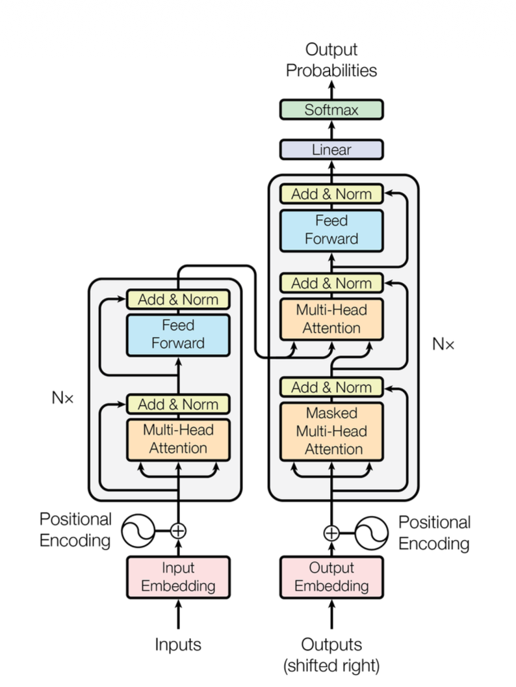
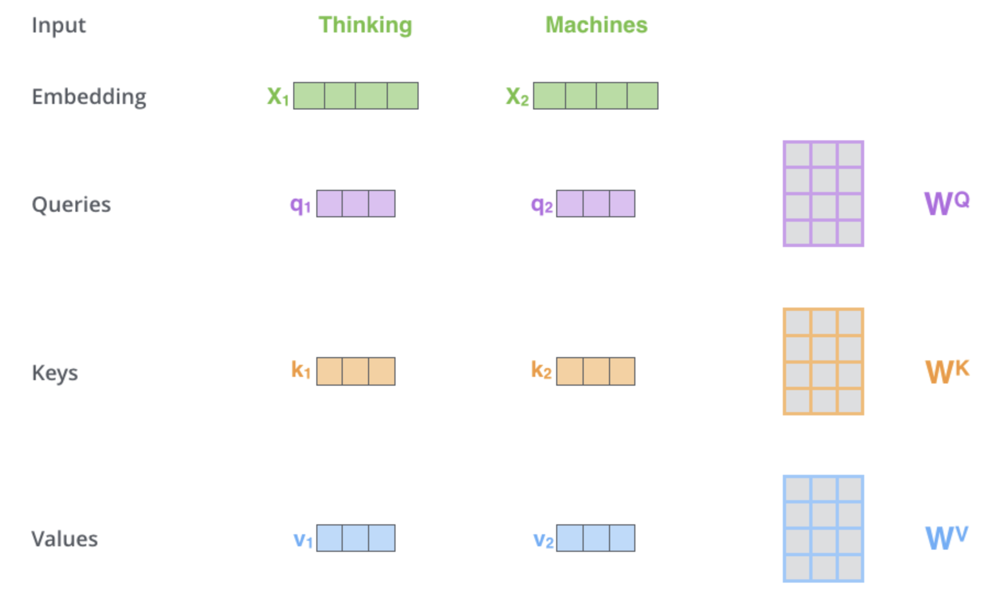
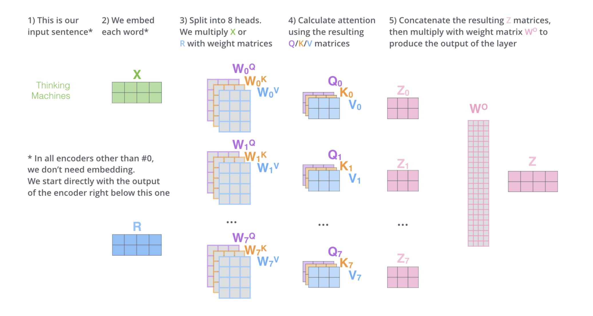

# Transformer理解

本笔记包含了我对transformer的一些个人理解。

作者： LZC from CUHKSZ

参考：[The Illustrated Transformer](https://jalammar.github.io/illustrated-transformer/)

## 整体架构

  

这是经典的transformer架构，左半部份为encoder，右半部份为decoder。transformer总体上来说实现了：

对于一个输入token序列，输出下一个token的概率分布。

## Encoder
对于一定长度的输入字符串序列，首先要通过tokenizer将序列划分为tokens，再按照预训练好的词嵌入规则将每个token映射为一个词向量。
对于每个词向量，都要再加上一个位置编码向量来增加此向量的位置信息。这样处理完后，就得到一个输入词向量序列。

图中的N代表要输入序列要经过N次同样的encoder模块处理，而每个encoder模块主要由一个多头注意力模块和一个前馈神经网络构成。

### 注意力机制

  

简单来说，对于每一个词向量（如上图中的x1），transformer中分别维护了三个参数矩阵W_Q,W_K,W_V，它们分别与x1相乘，就得到了x1对应的查询向量q1,键向量k1,值向量v1。

$$\text{Attention}(\mathbf{Q}, \mathbf{K}, \mathbf{V}) = \text{Softmax}\left(\frac{\mathbf{Q} \mathbf{K}^\top}{\sqrt{d_k}}\right) \mathbf{V}$$

将输入的每个词向量拼接为矩阵，再去与W_Q,W_K,W_V相乘，就得到输入的Q,K,V，根据Attention公式计算后就得到注意力机制的输出结果矩阵Z。下图描述了多头注意力的实现过程，多头注意力的每个“头”
表示了一组不同的W_Q,W_K,W_V（即不同方式的“注意”），经过每个头输出的Z最后再经过一个参数矩阵W_O相乘后，就得到了多头注意力机制最终的输出Z。

  

### Add & Norm
$$\mathbf{y} = \text{LayerNorm}(\mathbf{x} + \text{Sublayer}(\mathbf{x}))$$

在每个多头注意力或者前馈网络输出后，都要经过一个add&norm操作，表示层归一化加残差连接，公式如上。其中的
$\mathbf{x} + \text{Sublayer}(\mathbf{x})$表示残差连接，即将某模块的输入直接加到输出上。这有助于在向深层传递时保留一些原本信息和梯度。
LayerNorm是层归一化，它沿着特征维度在每个词向量上计算均值和方差，并执行归一化。

