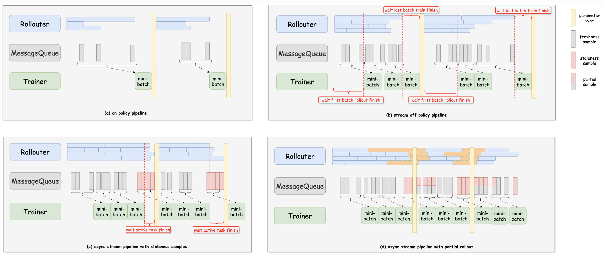
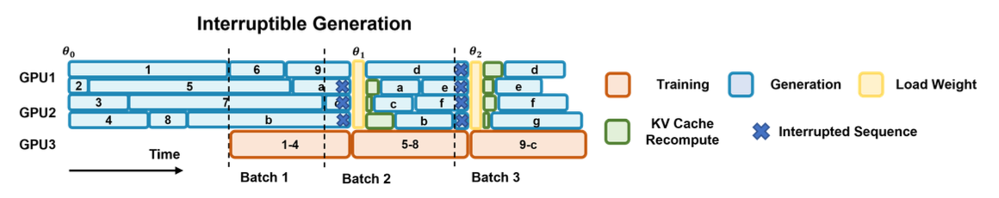
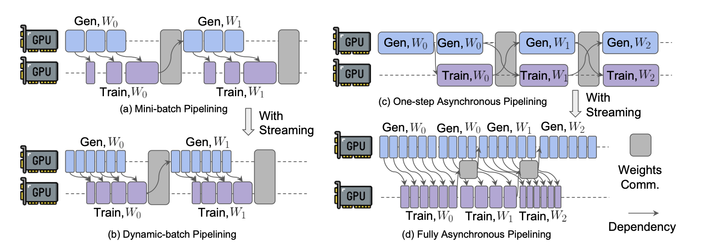
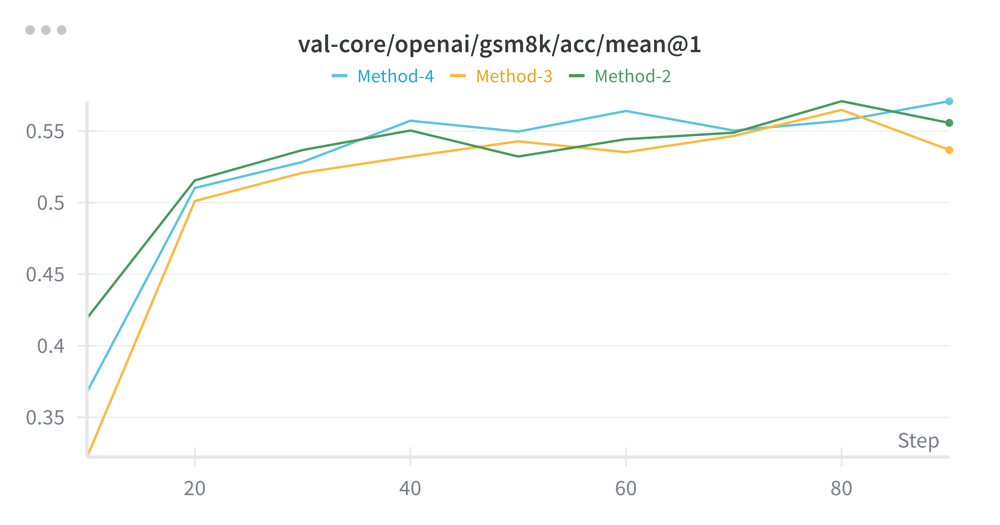
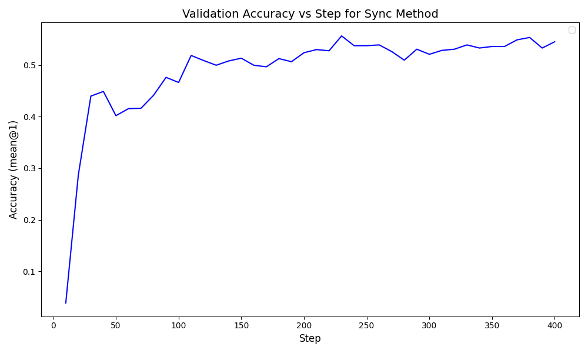
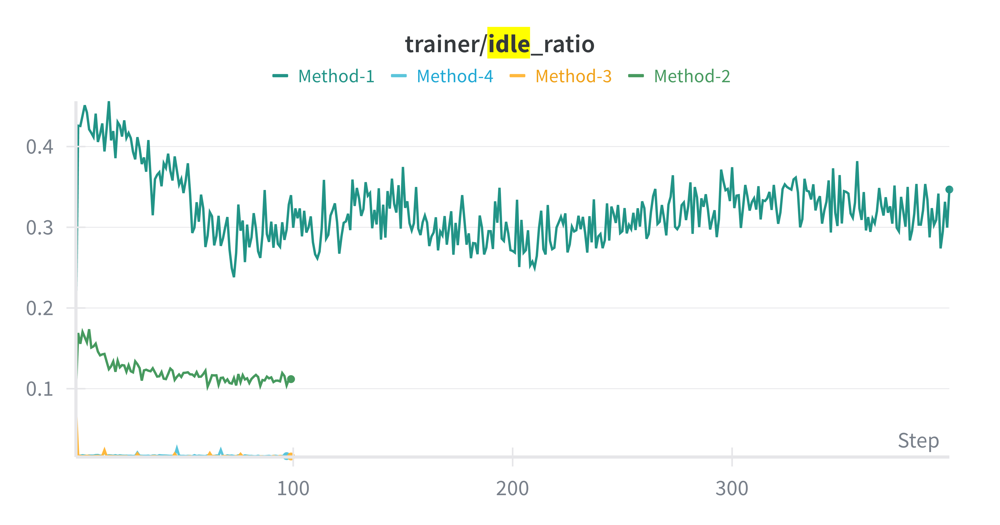

# Verl 完全异步训练 (Fully Async Trainer)

本笔记介绍了本人对verl中trainer和rollouter异步模式（Fully Async Trainer）的理解与简单实验结果，并阐述了几篇论文在verl的实现。

参考：[Recipe: Fully Async Policy Trainer](https://verl.readthedocs.io/en/latest/advance/fully_async.html)


## Understanding

<div id="fig:async_methods" style="text-align: center;">
  
  <p>图 1: 异步方法架构图</p>
</div>

上图集中说明了verl的四种采样和训练方式，由trigger_parameter_sync_step（rollouter和trainer参数同步之前trainer的更新次数）和staleness_threshold（允许使用过期样本的最大比例）这两个参数控制：
- trigger_parameter_sync_step=1, staleness_threshold=0: 对应上图(a)，表示传统on-policy同步更新。在每次训练中，首先由Rollouter生成一个更新所需batch(require_batches*ppo_mini_batch_size)的response，全部生成后Trainer进行参数更新，然后rollouter和trainer同步参数。显然，同一时间Rollouter和Trainer只有一个在工作，效率很低。
- trigger_parameter_sync_step>1, staleness_threshold=0: 对应上图(b)，表示one-step-off-policy更新。Rollouter一次性生成样本数为（require_batches\*ppo_mini_batch_size\*trigger_parameter_sync_step）的样本并放入消息队列，Trainer 每次从队列获取require_batches*ppo_mini_batch_size样本时执行本地训练，训练trigger_parameter_sync_step次后，Trainer 和 Rollouter 执行参数同步。在此方法中，长尾样本进入队列慢，不影响较短样本先凑够minibatch进行更新，并且Rollouter和Trainer实现了一定程度的并行，提高了效率。但是可以看到在一次同步周期的开始阶段Trainer处于空闲，在结束阶段Rollouter处于空闲。
- trigger_parameter_sync_step>=1, staleness_threshold>0, partial_rollout=False: 对应上图(c)，表示async stream pipeline with stale samples。此时若Rollout较快，Rollouter 会在参数同步之前生成一些额外的样本 num_stale_samples，供 Trainer 在同步后立即使用。触发参数同步时，如果 Rollouter 有正在进行的任务，它会等待这些任务完成，而不会添加新任务。（即等rollout进行完成后才同步）。这个方法补上了（b）的空缺。
- trigger_parameter_sync_step>=1, staleness_threshold>0, partial_rollout=True: 对应上图(d)，表示async stream pipeline with partial rollout。与方案 c 相比，当触发参数同步时，如果 Rollouter 正在生成样本，它会中断 rollout 进程并执行参数同步。同步完成后，被中断的样本将重新（继续or重新？）生成。这减少了等待活动任务完成的时间。但是，这就造成了一些response是由前后两个参数的Rollouter生成的，为什么能这样？下面会解释。

**注意on-policy, off-policy和同步、异步这两组概念的区别**

on-policy, off-policy是指对于一组数据，其采样的模型(Rollouter)和用其训练的模型(Trainer)是否一致，若一致为on-policy，不一致为off-policy。图1中除了（a）所示方法，其余均为off-policy。

同步、异步是指Rollouter是在将一组请求全部完成后再发送给Trainer（同步）还是可以分别发送（异步）。

## Paper Reading and implementation in verl

### AReal
<div style="text-align: center;">
  
  <p>图 2: AReal结构</p>
</div>


~~Areal中提出的rollout方式和Method-4一致，即在参数同步时将rollout过程中断，在Rollouter更新完成后继续进行被中断的任务。~~

~~那么这也带来了一个问题：同一个response由前后两个不同参数的Rollouter生成，这河狸吗？AReal论文中给出了证明，（但我没看懂）但是按照我个人的理解：$$r_t(\theta) = \frac{\pi_{\theta}(a_t \mid s_t)}{\pi_{\theta_{\text{old}}}(a_t \mid s_t)} $$既然off-policy是基于重要性采样得出，重要行采样比$r_t(\theta)$定义为新策略比原策略的比值，那么将分母中的“一个原策略”换成“另一个原策略”，本质上没有区别，公式依然成立。~~

*TODO* 对KV Cache重算的理解有问题

纠正：对于被中断的rollout任务，新的Rollouter并不会在中断处继续生成，而是重新从头生成，因此不涉及重要性采样问题。这里AReal的实现和


### Stream RL
这篇论文主要提出了两个创新点：

<div style="text-align: center;">
  
  <p>图 3: SteamRL结构对比</p>
</div>

+ 相比于传统的minibatch更新（rollout得到的结果每凑够一个minibatch，提交给trainer，上图a），论文提出流式传输（上图b），即每个rollout样本完成时立即传输至训练阶段。这样可以规避长尾样本带来的延迟问题，此功能在本文框架中已实现，本文即用流式传输。
+ 相比于one-step异步更新（上图c），论文提出全异步传输（上图d），即将参数同步过程完全移出主线，在参数同步过程中，Trainer调用之前流式传输存储下的数据进行训练，同时Rollouter也用原参数进行生成。此功能在本文框架中未实现，本文框架在参数同步时会进行中断。


## Code Reading

在代码实现层面，fully async通过定义一个FullyAsyncTaskRunner（对应默认的TaskRunner），其初始化时定义了四个主要模块：fully async trainer, fully async rollouter, message queue 和 parameter sync。

#### Fully Async Trainer

```angular2html
def fit(self):
        # 1. 验证数据初始化
        self._log_validation_data()

        # 2. 主循环
        while True:
            # A. 获取数据 (Red Time)
            epoch, batch = self._get_samples_from_queue()
            if batch is None: break 
            
            # B. PPO 核心训练逻辑（计算 Advantage、更新参数等，继承自基类）
            batch, reward_extra_infos_dict = self._process_batch_common(...)
            
            # C. 统计指标并决定是否同步参数
            self._trigger_parameter_sync_after_step(global_steps=self.global_steps)
            self.global_steps += 1
```
在Trainer的核心训练函数fit中，进行这样一个死循环：首先通过get_samples_from_queue()函数从消息队列中获取样本（get_samples_from_queue()函数同样通过一个循环不断从队列中获取样本），然后进行模型参数更新，再根据trigger_parameter_sync_step决定更新多少次后调用Parameter Sync将参数于Rollouter同步。

#### Fully Async Rollouter

```angular2html
async def _processor_worker(self):
        while True:
            # 检查是否需要暂停（例如：Trainer 还没消耗完数据）
            if self.paused or await self._should_pause_generation():
                await self.condition.wait() # 进入休眠等待唤醒
                continue

            # 从池子里拿一个 Prompt
            rollout_sample = await self.pending_queue.get()

            # 真正去跑推理（创建异步 Task）
            task = asyncio.create_task(self._process_single_sample_streaming(rollout_sample))
            self.active_tasks.add(task)
```
Rollouter内部维护了一个队列pending_queue用于存储需要处理的prompt，在主循环中不断从pending_queue中取prompt并调用process_single_sample_streaming()进行rollout。

```angular2html
async def _process_single_sample_streaming(self, rollout_sample: RolloutSample):
        # 1. 调用远程的 LLM 引擎生成回答 (Async Rollout)
        ret, is_cancel = await self.async_rollout_manager.generate_single_sample_async(...)
        
        if not is_cancel:
            # 2. 采样成功，填入当前的参数版本号
            rollout_sample.param_version = self.current_param_version
            # 3. 发送到 Trainer 拿数据的 Message Queue
            success = await self.message_queue_client.put_sample(
                sample=ray.cloudpickle.dumps(rollout_sample), ...
            )
        else:
            # 如果任务被中途取消（比如模型版本更新太快），塞进 cancel 队列重试
            await self.cancel_queue.put(rollout_sample)
```
在单个rollout完成时，结果会被直接发送给Message Queue。同时此样本会被打上相应的“版本号”（即对应第几次参数更新）便于staleness控制。

```angular2html
async def _should_pause_generation(self) -> bool:
        # 策略 A: 消息队列积压太多了 (Trainer 来不及练)
        if queue_size >= self.max_queue_size:
            return True
        # 策略 B: 已经采样但还没练的样本太多了 (Staleness 控制)
        if self.staleness_samples >= self.max_required_samples:
            return True
        return False
```
```angular2html
self.max_required_samples = int(
                self.required_samples
                * (self.staleness_threshold + 1)
                * self.config.async_training.trigger_parameter_sync_step
            )
```
Method中的staleness参数是如何发挥作用的呢？这里的(self.staleness_threshold + 1)表示一个“倍数”，self.required_samples是每次Trainer所消耗的数据，乘以trigger_parameter_sync_step即是每次参数同步过程Trainer消耗的总数据量。

如果staleness_threshold==0，那么Rollouter生成的数据等于Trainer消耗的数据，无过期样本。若staleness_threshold>0，每次Rollouter将会生成多于Trainer所需的样本，自然就成了“过期样本”。

```angular2html
async def pause(self):
    async with self.lock:
        self.paused = True
        # 如果开启了 partial_rollout，直接强行取消当前正在 GPU 上跑的推理任务
        if self.config.async_training.partial_rollout:
            await self.async_rollout_manager.cancel() # 丢弃旧版本的不完整计算
        
        if self.active_tasks:
            # 等待已提交的任务清理完毕
            await asyncio.gather(*self.active_tasks, return_exceptions=True)
            self.active_tasks.clear()
```
至于partial_rollout参数则是在pause函数中起作用，并在Parameter Sync运行时被调用。若启用partial_rollout，则在参数更新时会调用cancel()停掉现在的rollout进程，而_process_single_sample_streaming维护了一个cancel_queue，会接受被cancel的rollout任务并在rollouter更新后优先处理,重新采样。而不启用则会等待现在的rollout任务都执行完后才继续参数更新。

#### Message Queue

Message Queue主要定义了put_sample()接口供Rolllouter调用，每次put_sample后都自动通知Trainer。也定义了get_sample()供Trainer取用样本，并通过update_version()记录当前版本号。

#### Parameter Sync
```angular2html
def sync_weights(self, version, validate=False, global_steps=0):
        self.current_version = version
        
        # 1. 强制 Rollouter 刹车：停止当前的推理任务，清理 KV Cache
        ray.get(self.rollouter.pause.remote())

        # 2. 通知消息队列：之后收到的样本都是 version 版的了
        self.mq_client.update_param_version_sync(version)

        # 3. 执行真正的权重广播 (Broadcast)
        # 将 Actor 端的参数发送给所有 Rollout 节点
        self.actor_wg.sync_rollout_weights(self.sync_group_name)
        ray.get(self.rollout_wg.sync_rollout_weights(self.sync_group_name))

        # 4. 异步更新 Rollouter 内部版本状态，并尝试恢复生产
        # 注意：这里用 .remote() 异步执行，不阻塞同步主流程
        self.wait_last_update = self.rollouter.update_param_version.remote(version, validate, global_steps)
        self.wait_last_resume = self.rollouter.resume.remote(self.wait_last_update)
```
Parameter Sync首先将所有Trainer和Rollouter都Worker组合为一组，用NCCL建立通信。在主函数中，首先调用Rollouter都pause()函数停止rollout进程，然后进行权重的广播和更新。


## Experiment

针对Fully Async Trainer框架的四种主要方法设置对比试验：在GSM8K数据集上，用图1中的四种方法微调Qwen2.5-0.5B-Instruct模型，设定训练步数为100。比较其训练时间和在验证集上的准确率，结果如下：

<div style="text-align: center;">
  <div style="display: inline-block; text-align: left;">
    <table style="border-collapse: collapse; margin: 0 auto; border-bottom: 2px solid black;">
      <caption style="font-weight: bold; margin-bottom: 10px; text-align: center; caption-side: top;">
        Table 1: Performance Comparison of Different Methods on Qwen2.5-0.5B
      </caption>
      <thead>
        <tr style="border-top: 2px solid black; border-bottom: 1px solid black;">
          <th style="padding: 10px 24px; text-align: center;">Method</th>
          <th style="padding: 10px 24px; text-align: center;">Training Time / s</th>
          <th style="padding: 10px 24px; text-align: center;">Accuracy / %</th>
        </tr>
      </thead>
      <tbody>
        <tr>
          <td style="padding: 8px 24px; text-align: center;">Base (Qwen2.5-0.5B-Instruct)</td>
          <td style="padding: 8px 24px; text-align: center;">\</td>
          <td style="padding: 8px 24px; text-align: center;">1.00%</td>
        </tr>
        <tr>
          <td style="padding: 8px 24px; text-align: center;">Method-1</td>
          <td style="padding: 8px 24px; text-align: center;">10581.19 (2h3min)</td>
          <td style="padding: 8px 24px; text-align: center;">54.51%</td>
        </tr>
        <tr>
          <td style="padding: 8px 24px; text-align: center;">Method-2</td>
          <td style="padding: 8px 24px; text-align: center;">7229.81 (1h57min)</td>
          <td style="padding: 8px 24px; text-align: center;">55.57%</td>
        </tr>
        <tr>
          <td style="padding: 8px 24px; text-align: center;">Method-3</td>
          <td style="padding: 8px 24px; text-align: center;">6563.88 (1h45min)</td>
          <td style="padding: 8px 24px; text-align: center;">57.09%</td>
        </tr>
        <tr>
          <td style="padding: 8px 24px; text-align: center;">Method-4</td>
          <td style="padding: 8px 24px; text-align: center;">6554.63 (1h45min)</td>
          <td style="padding: 8px 24px; text-align: center;">53.68%</td>
        </tr>
      </tbody>
    </table>
  </div>
</div>

（Qwen2.5-0.5B-Instruct基模型的准确率是单独抽取测试集进行测试得出）

不同方法验证集的准确率随训练步数变化的曲线如下：

<div style="display: flex; flex-direction: column; align-items: center; margin: 2em 0;">
  <div style="display: flex; justify-content: center; align-items: center; gap: 15px;">
    
    
  </div>
  
  <p style="margin-top: 15px; font-weight: bold; text-align: center;">
    图 4: 四种方法验证集准确率对比图（右图为Method-1）
  </p>
</div>

其中，Method-1为on-policy，Method-2为one-step-off-policy，Method-3为async stream pipeline with stale samples，Method-4为async stream pipeline with partial rollout，其参数设置如下：
* Method-1: trigger_parameter_sync_step=1, staleness_threshold=0, partial_rollout=False
* Method-2: trigger_parameter_sync_step=4, staleness_threshold=0, partial_rollout=False
* Method-3: trigger_parameter_sync_step=4, staleness_threshold=0.5, partial_rollout=False
* Method-4: trigger_parameter_sync_step=4, staleness_threshold=0.5, partial_rollout=True

从实验图表中可以看到，相比于同步方法Method-1，异步方法2，3，4在训练时间上有明显的加快（30%-40%）。而在验证准确率方面，四种方法差别不大，其中Method-3稍好一点。

<div style="text-align: center;">
  
  <p>图 5: Idle Rate</p>
</div>

画出Trainer的GPU闲置率，可以看到同步方法Method-1的GPU闲置率最高，on-step-off-oplicy（Method-2）相比其减半，而Method-3,4的闲置率几乎为0，说明了异步方法对于GPU的利用更加高效。

*关于Step的解释：可以看到Method-1的step为400，而其他Method为100。这是因为当trigger_parameter_sync_step=4时，系统将4个更新（即一次参数同步）算作一个step，但是为保证训练量相同（即总minitbatch更新数相同），所以这样设置*


```
ValueError: Rollout mode 'sync' has been removed. 
Please set `actor_rollout_ref.rollout.mode=async` to use the native server rollout.
```