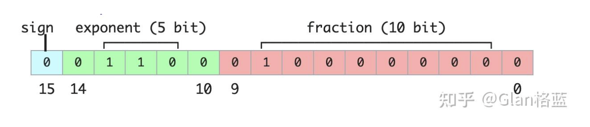
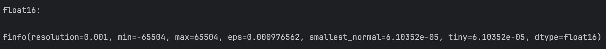
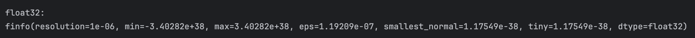
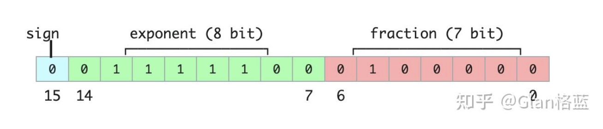
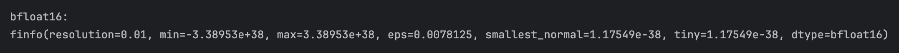
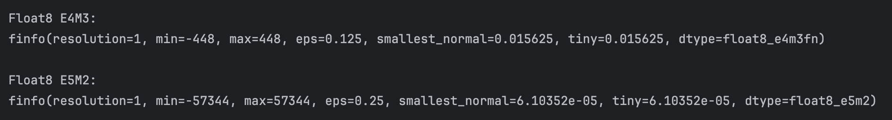
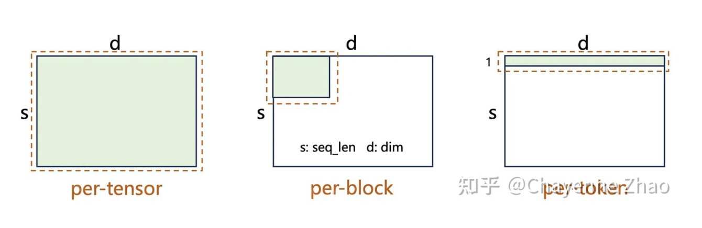
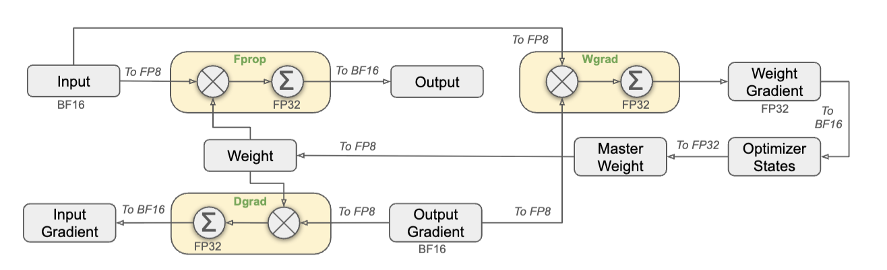

# Low Precision - 低精度训练

## 浮点类型

浮点数数值的计算方法如下。可以看出，浮点数的范围以及精度由指数位(exponent)和尾数位(fraction)的多少决定。
$$(-1)^{sign} \times 2^{exponent-offset} \times 1.fraction$$

### FP16
Half-precision floating-point，用16位二进制来表示的浮点数：

  
  
图 1: FP16

- Sign(符号位): 1 位，0表示整数；1表示负数。
- Exponent(指数位)：5位，简单地来说就是表示整数部分，范围为00001(1)到11110(30)，正常来说整数范围就是 
 ，但其实为了指数位能够表示负数，引入了一个偏置值，偏置值是一个固定的数，它被加到实际的指数上，在二进制16位浮点数中，偏置值是 15。这个偏置值确保了指数位可以表示从-14到+15的范围即 
 ，而不是1到30，注：当指数位都为00000和11111时，它表示的是一种特殊情况（零和无穷等）。
- Fraction(尾数位)：10位，简单地来说就是表示小数部分，存储的尾数位数为10位，但其隐含了首位的1，实际的尾数精度为11位，这里的隐含位可能有点难以理解，简单通俗来说，假设尾数部分为1001000000，为默认在其前面加一个1，最后变成1.1001000000

按照float计算公式，FP16能表示的最大正数为：
$$0111101111111111=(-1)^{0} \times 2^{30-15} \times(1 + \frac{1023}{1024}) = 65504$$

最小正数（正常情况下）为：
$$0000010000000000=(-1)^{0} \times 2^{1-15} \times(1 + \frac{0}{1024}) = 0.000061$$

打印出torch.finfo(torch.float16)语句，得到：

  
  
图 2: FP16 - finfo

其精度（即分辨率）为0.001（十进制），最小能表示的正数到e-5这一数量级，最大表示范围为-65504 ~ 65504。

（精度resolution：“如果我把这个数写成十进制，我能信任哪一位？即十进制下能够精确保证的最小分辨能力”（from Gemini））

### FP32
float32(Single-precision floating-point)，即32位浮点数，有8位指数位和23位尾数位。

分析方法同FP16。打印出finfo如下：

  
  
图 3: FP32 - finfo

可以看到精度达到了e-6，最小能表示的正数到e-38数量级，最大范围到了e+38数量级。精度高，范围大，但是占用空间也大。

### BF16
bfloat16(brain floating point)，有8位指数位和7位尾数位：

  
  
图 4: BF16

分析方法和FP一致。打印出finfo，如下：

  
  
图 5: BF16 - finfo

BF16的精度仅为0.01，但是最大表示范围以及最小能表示的正数都和FP32一致。

（以上内容复制自[LLM大模型之精度问题（FP16，FP32，BF16）详解与实践](https://zhuanlan.zhihu.com/p/657886517)）

### FP8
不同于上述浮点类型，8位浮点数(F8)尚无稳定版。但是有两种类型在深度学习训练中逐渐流行，即E4M3(4位指数，3位尾数)和E5M2(5位指数，2位尾数)。分别打印出finfo：

  
  
图 6: FP8 - finfo

在十进制表示下，它们的精度都是1，相当大了。而在二进制下，E4M3的精度为0.125，优于E5M2的0.25（从eps看）。除此之外，E5M2的表示范围以及最小可表示的正数都优于E4M3。

## 量化 - Quantization
### 基本公式
量化就是把高精度的浮点数转为低精度浮点数（如FP8）的方法。常见的量化策略有：per-tensor（逐张量）、per-block（逐块）和 per-token（逐 Token），所谓“逐”，就是以它为一组进行处理。

  
  
图 7: Quant Types

量化的计算公式如下：
1. 计算缩放因子 S (Scale)
$$S = \frac{max|X|}{V_{max}}$$
其中，$X$为“组”内的原（高精度）数据，$V$为目标低精度浮点数据，${V_{max}}$表示低精度浮点数据的最大可表示值（如448，对于FP8）。
2. 计算量化结果 Q：
$$Q(x) = round(\frac{x}{S})$$
其中，$x$表示原始张量$X$中的每个数值，$S$即位缩放因子。

为什么这么算？

将缩放因子S的计算公式回代，可以得到：
$$Q = \text{round}(\frac{X}{\max|X| / V_{\max}}) = \text{round}(\frac{X}{\max|X|} \cdot V_{\max})$$

其中，$\frac{X}{\max|X|}$就表示“此数值$x$占组内最大数值的百分比”，再乘以$V_{\max}$则表示“按此百分比乘以低精度数的最大值”，由此按组内相对大小转换为相应的低精度浮点数。由于比值最大为1，因此肯定不会发生溢出的情况。

在将低精度浮点数转换回相应的高精度浮点数时，会进行解量化操作，也就是反着再算一遍。量化和解量化操作会引入一定量的计算开销。

### Paper: QuRL
QuRL论文中主要提出了两个创新点：更新感知量化(Update-Aware Quantization, UAQ)以及自适应裁剪范围 (Adaptive Clipping Range, ACR)。

- UAQ：作者发现，在 RL 训练中，权重的单步更新量（约 $10^{-7}$）远小于 INT8 的量化颗粒度（误差约 $10^{-3}$），导致量化后的模型在很长一段时间内“看起来”没有变化。
为解决此问题，作者在层级间转移缩放因子。对于一个线性层 $Y = WX$，引入缩放因子 $s$，并作如下处理：$$W_{new} = W \cdot s, \quad X_{new} = X / s$$在实验中，s被设为1.5，这样放大了权重使得梯度更大，同时也保证了结果不变。
- ACR：量化前后的模型由于量化产生的误差，使得策略$\pi$的分布发生了改变。这种偏差经常会导致重要性采样比率$r_{t}$触发截断clip，导致相应梯度被舍弃。（其实也是off-policy问题）
ACR方法进行解耦，将更新的策略分为三个角色：行为策略 (Behavior Policy, $\pi_{behav}$)：量化模型，负责实际采样；近端策略 (Proximal Policy, $\pi_{prox}$)：全精度旧模型，作为裁剪的锚点（即$\pi_{old}$）；当前策略 (Current Policy, $\pi_\theta$)：正在被训练的全精度模型。
近端-行为策略比 (Proximal-to-Behavior Ratio) 为 $r_{i,t}^{pb}$：$$r_{i,t}^{pb} = \frac{\pi_{prox}(a_{i,t}|s_{i,t})}{\pi_{behav}(a_{i,t}|s_{i,t})}$$这个比值衡量了全精度旧模型与量化采样模型之间的概率偏差。传统的 PPO 裁剪是围绕 $1$ 进行的，而 ACR 将裁剪范围定义为以 $r_{i,t}^{pb}$ 为中心的区间。其目标函数中的裁剪部分被重定义为：$$\text{ACR-Clip}(r_{i,t}, \epsilon) = \min(r_{i,t} \hat{A}_{i,t}, \text{clip}(r_{i,t}, r_{i,t}^{pb} - \epsilon, r_{i,t}^{pb} + \epsilon) \hat{A}_{i,t})$$其中，$r_{i,t}$ 是当前正在训练的模型与量化采样模型的比值：$r_{i,t} = \pi_\theta / \pi_{behav}$。这意味着裁剪边界是动态的：下界 (Lower Bound): $L(r_{i,t}^{pb}, \epsilon) = r_{i,t}^{pb} - \epsilon$；上界 (Upper Bound): $U(r_{i,t}^{pb}, \epsilon) = r_{i,t}^{pb} + \epsilon$。
举个例子：$\pi_{prox} = 0.5$，但量化后的 $\pi_{behav} = 0.4$。 此时，$r_{i,t}^{pb} = 0.5 / 0.4 = 1.25$。若按\[0.8, 1.2]进行截断则哪怕$\pi_{\theta}$与$\pi_{behav}$保持一致，都一定会触发截断。而若以1.25为中心，则有更大的调整空间。

### 混合训练框架 - deepseek v3

  
  
图 8: 混合训练框架

图8中，Fprop表示前向传播，Dgrad表示损失函数对激活值的梯度，Wgard表示损失函数对模型权重的梯度。 

需理解反向传播的计算过程：$\mathbf{Y} = \mathbf{X} \mathbf{W}$, $\mathbf{G}_W = \mathbf{X}^T \mathbf{G}_Y$, $\mathbf{G}_X = \mathbf{G}_Y \mathbf{W}^T$，还需注意：图8中的Input, Output, Input Gradient, Output Gradient需要理解为“某一层的输入（输出）”，而非对于整个模型。

此外，这里还用到了细粒度量化（舍弃per-tensor，选择更小的分组）以及提高累加精度（原本的Tensor core对于矩阵乘加的结果只能用14位寄存器寄存，在这里重写了CUDA core使得可以以32位精度进行保存。）

## 计量单位
- FLOPS：FLOPS（Floating Point Operations per Second）指每秒浮点运算次数，可以理解为评估计算速度的单位。
- FLOPs（Floating Point Operations）指浮点运算次数，可以理解为描述总计算量的单位。从拼写上容易与FLOPS弄混、注意最后字母是小写s。
- MACs (Multiply ACcumulate operations)指 乘加累积操作次数，有时也用MAdds（Multiply-Add operations）表示，是微处理器中的特殊运算。

## 算力估算
基本原则：模型训练显存消耗可以分为：**模型参数（Model）+ 优化器状态（Optimizer status）+梯度值（Gradient）+激活值（Activation）**

1. Transformer && LLM FLOPs的估算：假设模型整个训练过程语料Token数是$T$，参数数量为$P$，可以估算Transfomer的FLOPs约等于：$$6 \times T \times P$$
$T \times P$表示将token输入模型得到前向传播结果，对于矩阵运算时的每个都需要经过一次乘法和一次加法，因此为$2 \times T \times P$。反向传播时，要同时计算激活值梯度和模型参数梯度([backpropagation](../LLM-notes/neural.md))，因此运算量为$4 \times T \times P$（注意，这里算的是运算量。对于显存，不能这样计算）。
2. 一个模型参数为 7B（7×10⁹），如果使用 FP16，每个参数占 2 Bytes，问优化器状态（假设有 2 份）+ 参数本身共占多少显存？

    - 模型参数：FP16大小为2Bytes，因此模型参数大小为：$7 \times 10^9 \times 2$ Bytes = 14 GB
    - 梯度：每个模型参数的梯度，大小为：$7B \times 2$ Bytes
    - 优化器：
        - Master Weights：优化器中维护一个FP32的模型参数副本。因为每次参数的更新量很小，如果用FP16那么很可能更新不动模型。大小为$7B \times 4$ Bytes.
        - 一阶动量：$7B \times 4$ Bytes
        - 二阶动量（动量需精确累积，要求高精度）：$7B \times 4$ Bytes
    - 激活值：是动态的，随着batchsize以及sequence length剧烈波动，可以通过设置Checkpoint等技术显著降低。
    - sequence_length * 
        
      共$7B \times 16$ Bytes=112GB。

## 其他

### Checkpoint
在正常的模型训练过程中，每个隐藏层中前向转播的激活值都会被保存，随着训练进行，大量的激活值可能导致显存OOM。

引入梯度检查点机制：在前向传播过程中，只保存特定层的激活值（称为检查点），其余层的激活值用完直接舍弃。反向传播时，对于未保存的激活值，需要从特定的检查点开始重算，以时间换内存。

### 梯度累积 - Gradient Accumulation
梯度累积指将一个大 Batch 分成多个小 Step 计算，但不立即更新权重，而是将梯度累积起来，等达到目标数量后再统一更新。

例如：假设我们要模拟的 Global Batch Size 是 64，但显存只能塞下 Micro Batch Size 为 8 的数据，我们需要设置 accumulation_steps = 8（即 $64 \div 8$），每次分别取8个样本进行前向传播和反向传播，并将梯度保留在显存，累加8次后更新模型。

梯度累积实现了小batch size模拟大batch size的功能，节省了显存空间。

