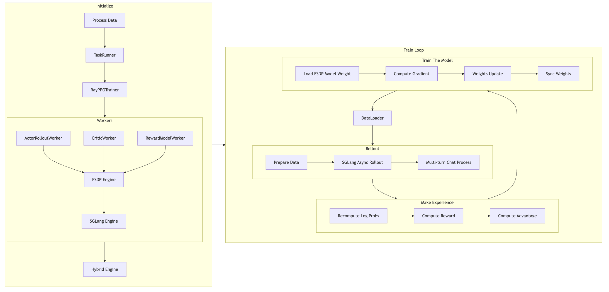

# Verl框架理解 - talk 1 

本笔记记录了我对强化学习框架verl的一些理解。

作者： LZC from CUHKSZ

参考：[Awesome-ML-SYS-Tutorial](https://github.com/zhaochenyang20/Awesome-ML-SYS-Tutorial/blob/main/rlhf/verl/multi-turn/code-walk-through/readme.md).


## 整体架构
<div style="text-align: center;">
  
</div>

## Walk Through
### Config
以训练脚本run_qwen2.5-3b_gsm8k_multiturn.sh为例：
```bash
PROJECT_DIR="$(pwd)"
CONFIG_PATH="$PROJECT_DIR/examples/sglang_multiturn/config"

python3 -m verl.trainer.main_ppo \
    --config-path="$CONFIG_PATH" \
    --config-name='gsm8k_multiturn_grpo' 
```
这是指定了一个config_path，指向了CONFIG_PATH 下的 gsm8k_multiturn_grpo.yaml：
```bash
hydra:
  searchpath:
    - file://verl/trainer/config
defaults:
  - ppo_trainer
  - _self_
data:
  max_prompt_length: 1024
```
这里又指向了verl/trainer/config/ppo_trainer.yaml：
```bash
defaults:
  - actor@actor_rollout_ref.actor: dp_actor
  - npu_profile@trainer.npu_profile: npu_profile
actor_rollout_ref:
  hybrid_engine: true
  model:
    path: ~/models/deepseek-llm-7b-chat
```
在ppo_trainer.yaml中，我终于找到了run_qwen2.5-3b_gsm8k_multiturn.sh里尝试向其属性赋值的model,data,algorithm等。由此总结：
在起训练脚本中的config是三级覆盖结构，由run_qwen2.5-3b_gsm8k_multiturn.sh到ppo_trainer.yaml逐级覆盖。因此要调整或写一个新的起训练脚本时，
需要了解清楚ppo_trainer.yaml都定义了什么。

### Ray
Ray是一个分布式框架，用于将单个机器上的任务扩展到分布式计算资源中。
- Ray Task：一个独立的计算单元，没有专属的计算资源，运行得到返回结果后就被做掉，内部状态销毁。
- Ray Actor：在某个Ray Worker上绑定的一个专门的进程，该进程会一直运行直到被专门销毁，且它在每次执行完后会保留内部状态。
- Ray Worker：有一定计算资源的进程，是真正执行代码的工作单元。Ray Task和Ray Actor都是在Ray Worker上执行，区别在于Ray Actor对应专属Ray Worker。

## ActorRolloutRefWorker 和 RayWorkerGroup
ActorRolloutRefWorker是首先被定义为一个Ray Actor，和其他的RL Worker类（如CriticWorker）等，在实例化时统一创造一个RayWorkerGroup的实例
workgroup（wg），通过此实例的init方法进行初始化。由此实现了不同RL Worker的资源统一管理，RayWorkerGroup是RL Worker和GPU之间资源调度的中间层。

ActorRolloutRefWorker的init()函数中，可以根据传入的参数role来确定Worker是Actor,Rollout还是Reference。
- Actor模型：执行token预测的核心模型
- Rollout模型：收集Actor模型的Rollout数据？？？？？？？？？？？？
- Ref模型：原模型，用于在计算新旧策略比值时计算原策略$\pi$

ActorRolloutRefWorker._build_model_optimizer()：主要加载了模型并定义了优化器。

ActorRolloutRefWorker._build_rollout()：在这里初始化了worker的rollout类是SGLangRollout,并初始化FSDP权重分片。

SGLangRollout.init()：初始化工具调用和SGLangEngine。

SGLangRollout.AsyncEngine类：定义释放显存，更新显存，更新权重，刷新KVcache等除了Rollout之外的所有方法。

## 主函数
主函数是TaskRunner.run()，其中根据配置指定了不同的Worker类，实例化了RayPPOTrainer，
调用了它的init_worker类将worker实例化到GPU资源上，用fit方法开始训练。

RayPPOTrainer是训练过程中核心的类，诸如优化器，config，worker，tokenizer等配置全部保存在此类中。（verl.trainer.ppo.core_algos的AdvantageEstimator记录了核心的算法选择，如GRPO等，扩展算法时研究这一块）

RayPPOTrainer.fit是训练的核心方法，实际训练（for epochs）在这里实现。

RayPPOTrainer.init_workers()实现了workers的实例化。

## Dataset

RLHFDataset类从本地读取parquet文件，通过一系列规范化处理得到一个包含所有关键信息的字典。
其中，最重要的就是tools_kwargs，定义了工具的调用。

？？？？？但是，在华为数据里，里面关于工具的调用是tools字段，不是tools_kwargs

## RayPPOTrainer.fit ->核心训练
for epochs：
对于每个样本进行多次采样，计算新旧policy，计算优势函数，更新网络参数。


TODO：看源码里log probs是怎么算的？

## Async
异步Rollout是指把一个batch request分为单个的request丢进SGLang来得到回答，主要是因为一个batch中的各个request的工具调用同时进行的话大概率会拥堵，且难以用状态机协调管理。且不同request的rollout的长度一般不一样，有的长有的短，如果采用同步的方式，先完成的request就要等很久。

## 数据流
A：Parquet 文件 --> B：RLHFDataset --> C：DataLoader + collate_fn --> D：DataProto 原始数据 --> E：pop 提取生成数据 --> F：Rollout 生成 --> G：union 合并数据 --> H：奖励计算 --> I：优势计算 --> J：重新计算 log_probs --> K：计算参考 log_probs --> L：计算价值函数 --> M1：更新 critic --> M2：更新 actor --> N：返回训练指标

## Rollout
核心的rollout在sglang里的generate_sequence实现，如果在multi-turn情况下就将batch拆分为单个request调用_req_level_generate_sequences，否则还是以batch的形式。

#### _req_level_generate_sequences
```
@GPUMemoryLogger(role="sglang rollout", logger=logger)
@torch.no_grad()
def _req_level_generate_sequences(self, prompts: DataProto, **kwargs) -> DataProto:
    # Async rollout with tools support
    do_sample = prompts.meta_info.get("do_sample", True)
    is_validate = prompts.meta_info.get("validate", False)
    tgt_device = prompts.batch["input_ids"].device
    if self._tp_rank == 0:
        req_list = self._preprocess_prompt_to_async_rollout_requests(
            prompts,
            n=1 if is_validate else self.config.n,
        )
        loop = asyncio.get_event_loop()
        output_req_list = loop.run_until_complete(
            asyncio.gather(
                *[self._async_rollout_a_request(req, do_sample, is_validate, **kwargs) for req in req_list],
            )
        )
        sorted_output_req_list = sorted(output_req_list, key=lambda x: (x.batch_data_id, x.rollout_offset))
    else:
        sorted_output_req_list = None
```
这个函数除了后续的一些数据处理外，核心在于先通过_preprocess_prompt_to_async_rollout_requests将batch处理为单个异步请求，然后通过_async_rollout_a_request进行rollout。

在_preprocess_prompt_to_async_rollout_requests中将每个request的工具调用状态初始化为状态机AsyncRolloutRequest。

在_async_rollout_a_request中，终于实现了核心的rollout功能。这里的工具定义状态机其实和eval.py中的工具调用逻辑类似，即在循环中的RUNNING检测SGLang生成的内容中是否有工具调用，
如果有则进入TOOL_CALLING状态执行调用并返回，返回的结果加入到消息历史中让模型看到工具结果再进行rollout，直到模型不发起工具调用为止。


## 术语
### FSDP
Fully Sharded Data Parallel，完全分片数据并行，将大模型的所有状态（参数，梯度和优化器状态等）在不同的GPU之间分片，从而大幅减少每个GPU等内存占用。
FSDP 通过以下两个关键步骤动态地重构参数：

前向传播 (Forward Pass)：
在计算某一层之前，所有 GPU 会通过 AllGather 操作，将该层分散在各个 GPU 上的参数片段收集起来，临时 构成完整的参数副本。
计算完成后，完整的参数副本会被立即释放 (Free)，只保留该 GPU 自身的分片，从而节省显存。

反向传播 (Backward Pass)：
过程类似，但在计算完梯度后，只保留该 GPU 对应分片参数的梯度，并通过 ReduceScatter 操作将梯度发送并汇总到各自参数分片所在的 GPU 上，完成梯度同步。

### KV cache
